# Laboratio para creación de usuario en Microsfot Entra ID y habilitación de mfa

# Introducción

En el presente laboratorio se mostrará como crear un usuario, y habilitar el mfa en el servicio de Microsoft Entra Id

## 1. Creación de usuario

Ingresar al portal de azure e ingresar al servicio de Microsoft Entra Id
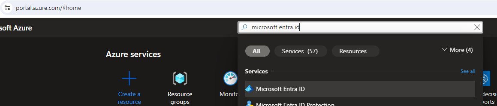

Darle click sobre la opción de users
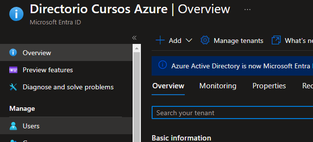

Click en Create users

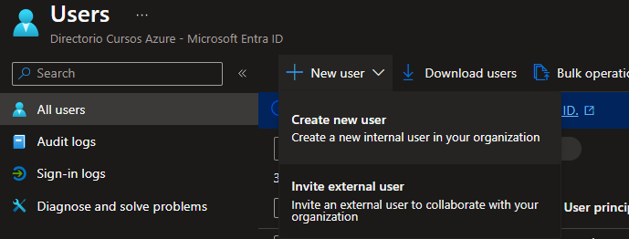

Ingresar los datos solicitados, adicional a ello copiar el user principal name y el password en un txt, ya que estos datos se necesitarán mas adelante para ingresar

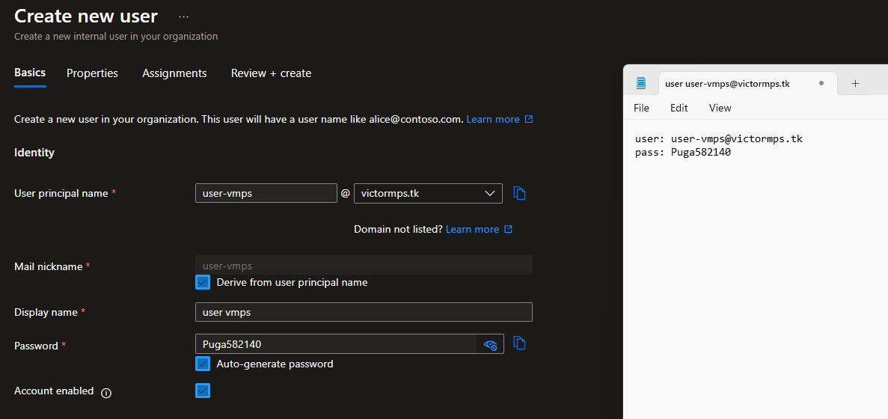

Existen mas datos para agregar en las otras pestañas, pero en este caso vamos directo a la opción de review + create

y click en create para crear a nuestro nuevo usuario

El se mostrará al finalizar la creación
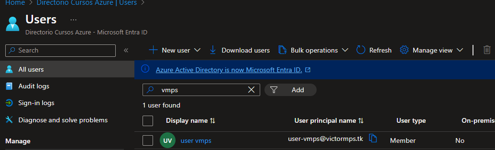

## 2. Validación de login del usuario 

Vamos a probar el login en una ventana de incognito

En un navegador en incognito, vamos a autenticarnos con las credenciales del usuario creado en el paso anterior
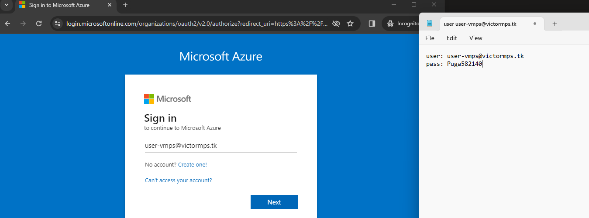

Una vez autenticado, nos va a pedir cambiar la contraseña, aqui recomiendo generar un nuevo password

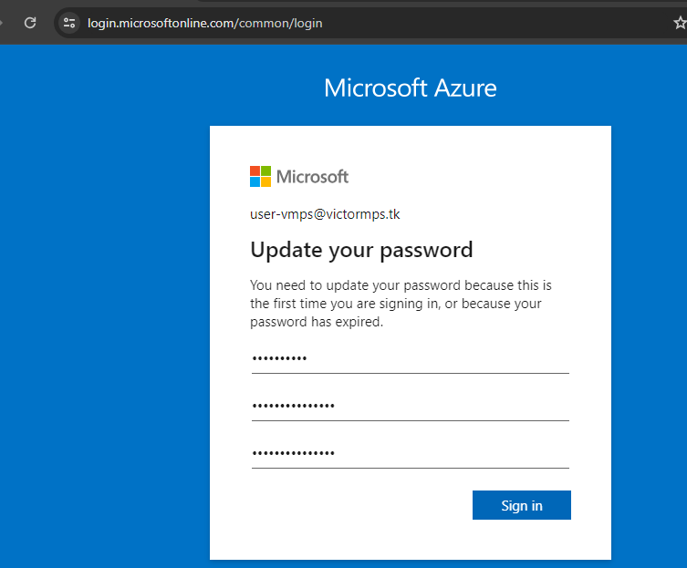

Nos pedirá configurar el microsoft authenticator, pero le hacemos click en ask later, pues la configuración de mfa lo vamos a forzar desde el portal
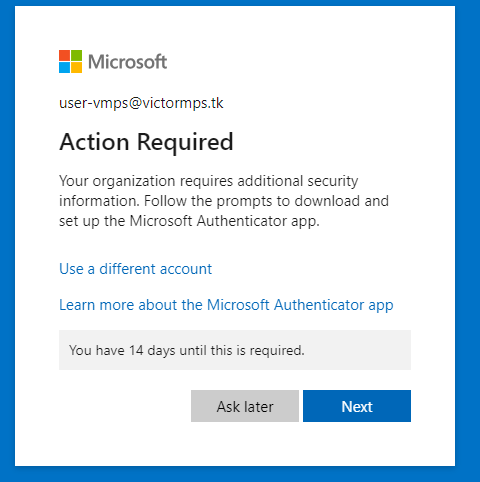

y con ello validamos que el usuario puede autenticarse, utilizando solo la cuenta de correo y contraseña

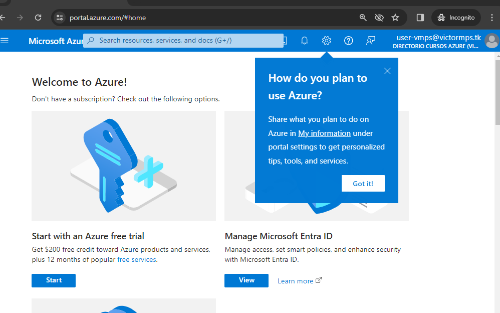

## 3. Habilitando el MFA

En el portal de azure con nuestra cuenta con permisos sobre el microsoft entra, en users, en las opciones superiores, vamos a hacerle click sobre Per-User MFA
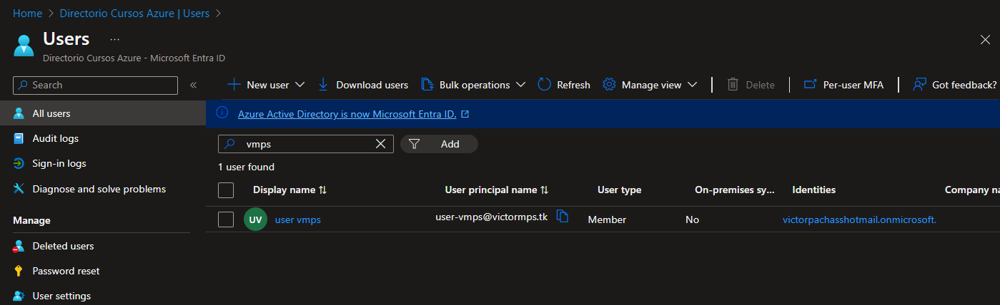

En el portal que carga vamos a buscar nuestro usuario, lo seleccionamos y en la parte derecha le damos click en la opción habilitar
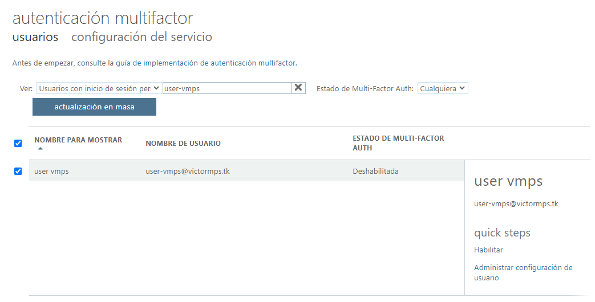

Nos saldrá otra ventana para confirmar el cambio, para lo cual le damos click en habilitar mfa
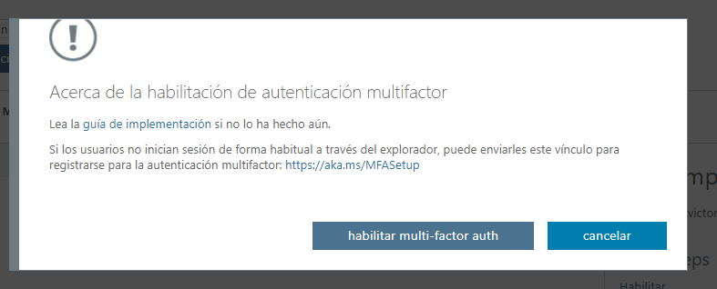

Con esto hemos activado el mfa al usuario, pero no será obligatorio, para ello, volvemos a seleccionar nuestro usuario, y le damos click en forzar.

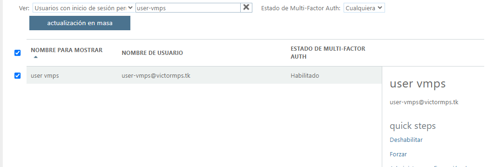

Nos saldrá una nueva ventana para confirmar, para lo cual damos click en Forzar multi-factor auth
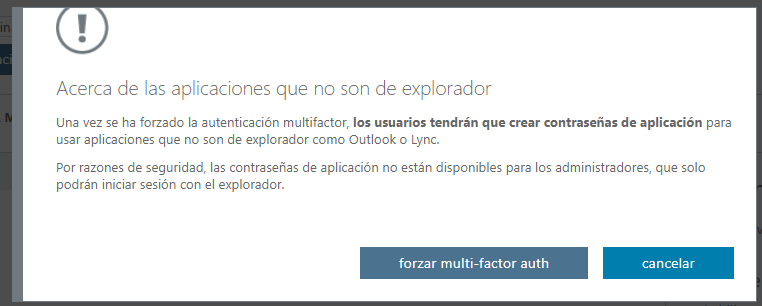

Nos confirmará el cambio con este mensaje
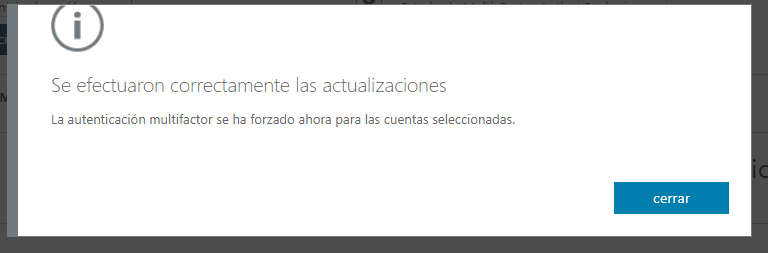

## 4. Configurar MFA en usuario creado
Cerramos todas la ventanas de incognito que hubiesemos abierto antes, y en una nueva nos autenticamos con el mismos usuario creado anteriormente
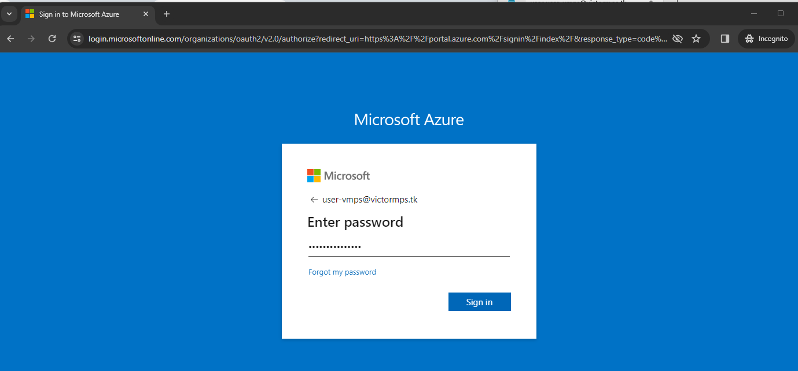

Ahora será obligatorio la configuración del multifactor authentication

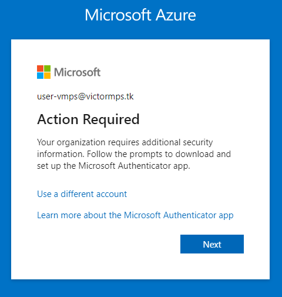

Nos saldrá un mensaje, donde nos indica que debemos de instalar el microsoft authenticator en nuestro celular, lo cual debemos de realizar, y vez echo ello, le damos click en Next
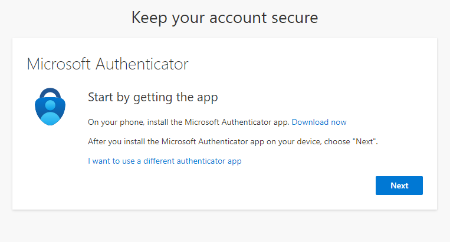

En el siguiente mensaje nos indica que en el celular, en la aplicación microsoft authenticator debemos de darle click en añadir cuenta y seleccionar "work or school"

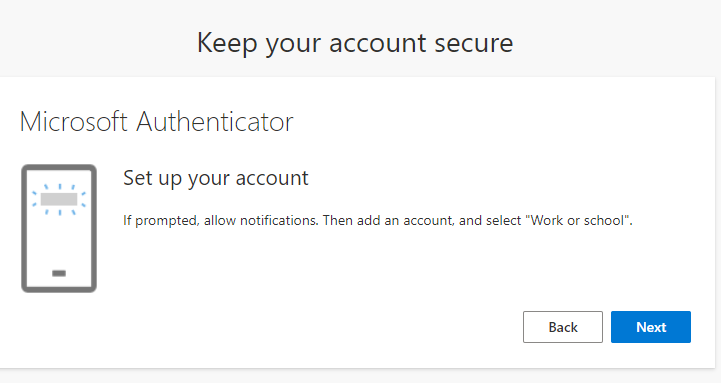

Damos click en la opción de Scan QR, y escaneamos el QR que se muestra en pantalla
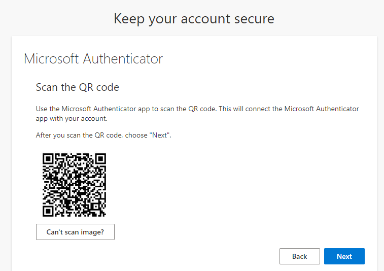

Una vez finalizado el scan y le hemos dado click en siguiente, nos llegará una notificación a nuestro celular, en el cual colocamos el par de digitos que se muestra en la web
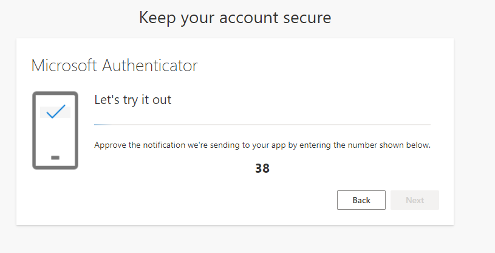

Si lo hacemos de forma correcta, nos mostrará que la notificación 
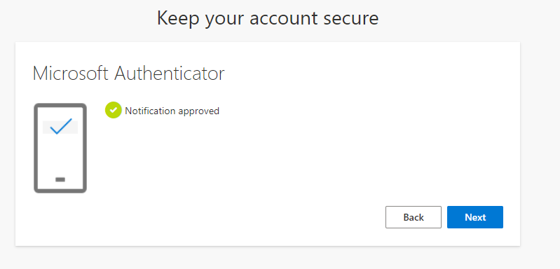

## 5. Validar el uso de MFA

Cerramos nuevamente todas las ventanas de incognito, y volvemos a abrir y nos volvemos a autenticar con la misma cuenta, para lo cual ingresamos el usuario y contraseña respectivo

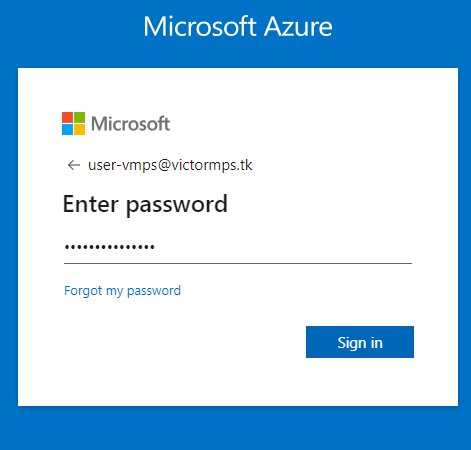

Adicional a ello, nos pedirá validar nuestra identidad enviandonos un código a nuestro celular

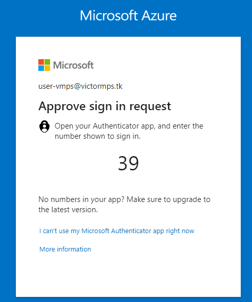

El cual luego de ingresado recien nos permitirá ingresar.

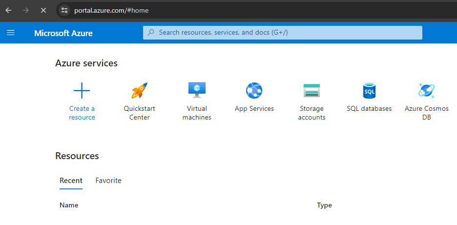
